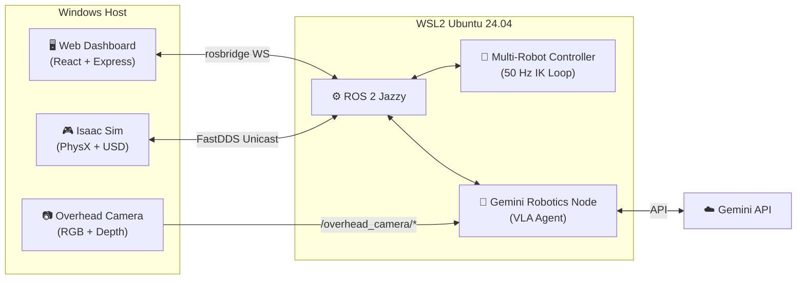

# Gemini Robotics ER × Isaac Sim — Multi-Robot VLA Tower Stacking


Three Franka FR3 robotic arms cooperate to build a 9-layer tower, orchestrated by **Google Gemini Robotics-ER** as a Vision-Language-Action (VLA) brain — all running in NVIDIA Isaac Sim with ROS 2.

<!-- TODO: Add demo GIF here -->
<!--  -->

---

## ✨ Highlights

- **Multi-Robot Cooperation** — 3 Franka FR3 arms coordinate to pick, transport, and stack 9 colored blocks into a tower
- **VLA Brain** — Google Gemini Robotics-ER analyzes overhead camera feeds, plans tasks, and dispatches parallel robot commands via Function Calling
- **Dual Control Modes** — Switch between the Gemini VLM orchestrator and a standalone rule-based motion planner (no API needed)
- **Industrial Monitoring Dashboard** — Salabim-inspired React UI with live KPI utilization tracking, 2D digital twin map, enhanced timeline, and discrete event logging
- **Cross-OS Bridge** — Seamless Windows ↔ WSL2 communication via FastDDS Unicast, fully automated on each boot
- **Mobile Manipulation** — Bonus demo: Nova Carter mobile base + FR3 arm with LiDAR and RGB-D sensing

---

## 🏗️ Architecture



---

## 📋 Prerequisites

| Requirement | Minimum |
|-------------|---------|
| **OS** | Windows 10/11 with WSL2 enabled |
| **GPU** | NVIDIA RTX 3060+ (8 GB VRAM) |
| **RAM** | 16 GB |
| **Disk** | 50 GB free |
| **Node.js** | 18+ |
| **API Key** | [Google Gemini](https://aistudio.google.com/apikey) (free tier works) |

---

## 🚀 Installation & Quick Start

Follow these steps to set up the dual Windows/WSL2 environment from scratch.

### Step 1: Install NVIDIA Isaac Sim (Windows)
1. Download and install the [NVIDIA Omniverse Launcher](https://www.nvidia.com/en-us/omniverse/).
2. Log in with your NVIDIA account.
3. Go to the **Exchange** tab, search for **Isaac Sim**, and install version **4.5.0** or **6.0.0**.
4. Once installed, Isaac Sim's Python environment will act as the simulation host.

### Step 2: Clone the Repository
Open a Windows terminal (Command Prompt or PowerShell):
```bash
git clone https://github.com/mincasurong/IsaacSim_GeminiRobotics.git
cd IsaacSim_GeminiRobotics
```

### Step 3: Set Up WSL2 & ROS 2 Jazzy
The robotic controllers run on a Linux subsystem (WSL2) to take advantage of the native ROS 2 ecosystem.

1. Open PowerShell **as Administrator** and install Ubuntu 24.04:
   ```powershell
   wsl --install -d Ubuntu-24.04
   ```
2. Once Ubuntu is installed and you have created your UNIX username/password, run the automated setup script inside the WSL2 terminal:
   ```bash
   cd /mnt/d/git/IsaacSim_GeminiRobotics/wsl_ws
   chmod +x setup_all.sh
   ./setup_all.sh
   ```
   > *Note: This script installs ROS 2 Jazzy, build tools, Python packages, and configures the FastDDS network bridge between Windows and WSL2. It may take 15-30 minutes.*

### Step 4: Configure Gemini API Key
Back in your Windows terminal, copy the `.env` template and add your API key:
```bash
cp .env.example private/.env
```
Open `private/.env` in any text editor and insert your Gemini API Key.

### Step 5: Start the Web Dashboard
```bash
cd gemini_web_gui
npm install
npm run build
```

### Step 6: Launch the System!
1. **Web Dashboard**: Double-click `scripts/start_dashboard.bat` in the project root. Your browser will open to `http://localhost:5173`. Click the **▶ Start** button.
2. **Simulation**: Open Isaac Sim from the Omniverse Launcher, go to *File → Open Script*, select `isaacsim_scripts/three_robot_tower.py`, and press **Play**.
3. **Execute**: In the web dashboard chat, type: `"Build a 9-layer tower"` to see Gemini orchestrate the robots!

---

## 🎮 Web Dashboard

A ChatGPT-style interface for controlling and monitoring the robot system:

<!-- TODO: Add screenshot -->
<!--  -->

The dashboard features four dedicated monitoring tabs alongside the main chat view:

| Feature | Description |
|---------|-------------|
| 📊 **KPI Dashboard** | Live resource utilization bars, real-time state badges (PICKING, PLACING, QUEUED), and task success/failure counters |
| 📈 **Enhanced Timeline** | Advanced Gantt chart visualizing execution phases and queue/waiting times (orange segments) with zooming capabilities |
| 🗺️ **2D Scene Map** | Lightweight SVG digital twin tracking block tokens, robot arm movements, and the target tower in real-time |
| 📋 **Event Trace** | Filterable, sortable discrete event log table with duration calculations and CSV export |
| 💬 **VLA Chat** | Send natural language goals via text or voice, and monitor the Gemini agent's reasoning |
| 📜 **Terminal & Logs** | Integrated WSL2 terminal, `/rosout` log streaming, and one-click `colcon build` |

---

## 🤖 System Components

### `isaacsim_scripts/` — Isaac Sim Scenes
| Script | Description |
|--------|-------------|
| `three_robot_tower.py` | Main demo: 3x FR3 + 9 blocks + overhead camera |
| `fr3_vision.py` | Wrist camera simulation for vision experiments |
| `assemble_industrial_mobile_manipulator.py` | Carter + FR3 mobile manipulation scene |

### `wsl_ws/src/isaac_ros2_control/` — ROS 2 Package
| Module | Description |
|--------|-------------|
| `multi_robot_controller.py` | 50 Hz control loop with DLS IK, turn-based stacking |
| `gemini_robotics_node.py` | Gemini VLM agentic loop with Function Calling |
| `kinematics.py` | Analytical & DLS Inverse Kinematics, Null-Space projection |
| `gemini_prompts.py` | Structured prompt templates with scene coordinates |
| `gemini_tools.py` | Function calling tool schemas (`pick`, `place`, `go_home`, etc.) |

---

## 📐 Scene Layout

```text
                  [ Source Table 3 (FR3_3) ]
                     R=1.05m, θ=150°
                           │
                    [ FR3_3 Base ]
                     R=0.45m, θ=150°
                           │
[ Source Table 1 ] ──── [ FR3_1 Base ] ──── [ Center Target Table ] ──── [ FR3_2 Base ] ──── [ Source Table 2 ]
  R=1.05m, θ=270°      R=0.45m, θ=270°           R=0.0m              R=0.45m, θ=30°       R=1.05m, θ=30°
```

- **Main Workbench**: 2.8 × 2.8 × 0.20 m, centered at origin
- **3 Robot Bases**: Mounted at R = 0.45 m on the workbench (Z = 0.20 m)
- **3 Source Tables**: 0.50 × 0.50 × 0.10 m at R = 1.05 m (20 cm clearance from robots)
- **1 Target Table**: 0.36 × 0.36 × 0.10 m at center (12 cm clearance from all robots)

### 9-Block Specifications

| Block | Robot | Shape | Color | Position (m) |
|-------|-------|-------|-------|---------------|
| Block1 | FR3_1 | Cube | 🔴 Red | [-0.12, -1.05, 0.33] |
| Block2 | FR3_1 | Cylinder | 🟢 Green | [0.00, -1.15, 0.33] |
| Block3 | FR3_1 | Cube | 🔵 Blue | [0.12, -1.05, 0.33] |
| Block4 | FR3_2 | Cylinder | 🟡 Yellow | [0.81, 0.43, 0.33] |
| Block5 | FR3_2 | Cube | 🟣 Magenta | [1.01, 0.48, 0.33] |
| Block6 | FR3_2 | Cylinder | 🔵 Cyan | [0.91, 0.63, 0.33] |
| Block7 | FR3_3 | Cube | 🟠 Orange | [-1.01, 0.48, 0.33] |
| Block8 | FR3_3 | Cylinder | 🟣 Purple | [-0.81, 0.43, 0.33] |
| Block9 | FR3_3 | Cube | 🟢 Lime | [-0.91, 0.63, 0.33] |

---

<details>
<summary><h2>🧮 Control Algorithms (click to expand)</h2></summary>

### Dual-Safety Dynamic Stacking Height
Ensures blocks stack progressively without colliding with previously placed layers:
$$\text{target\_z} = \max(\text{tf\_place\_z},\;\text{base\_place\_z})$$
$$\text{base\_place\_z} = Z_{\text{table}} + Z_{\text{half\_block}} + 0.005 + (\text{tower\_height} \times 0.06)$$

### Damped Least Squares (DLS) Inverse Kinematics
$$\mathbf{J}^\dagger = \mathbf{J}^T (\mathbf{J} \mathbf{J}^T + \lambda^2 \mathbf{I})^{-1}$$
$$\Delta \mathbf{q} = \mathbf{J}^\dagger \mathbf{e} + (\mathbf{I} - \mathbf{J}^\dagger \mathbf{J}) k_{\text{null}} (\mathbf{q}_{\text{home}} - \mathbf{q})$$
The null-space projection term keeps joints near their home configuration while tracking the Cartesian target, preventing singularities and joint limit violations.

### Pose Randomization on Reset
$$\Delta x, \Delta y \sim \mathcal{U}(-0.035, 0.035)\,\text{m},\quad \theta \sim \mathcal{U}(0, 2\pi)$$
</details>

---

## 🔧 Troubleshooting

| Issue | Root Cause | Solution |
|-------|-----------|----------|
| `TF_OLD_DATA ignoring data from the past` | ROS 2 node using wall-clock instead of sim `/clock`, or ghost `kit.exe` instances | Set `use_sim_time: True`. Kill zombie sims: `Stop-Process -Name "kit" -Force` |
| `Frame with name ... already exists` | Multiple FR3 instances share child link names | Apply `isaac:nameOverride` via `configure_robot_tf_names` before starting |
| `This app can't run on your PC` | `.bat` file corrupted with UTF-8 BOM characters | Re-save with clean ASCII encoding and CRLF line endings |
| Robot places blocks into first floor | `tower_height` reset during TF lookup timeouts | Fixed by dual-safety max(tf_z, base_z) height formula |

---

## 📖 Documentation

| Document | Description |
|----------|-------------|
| [Development Guide](docs/DEVELOPMENT.md) | Architecture, build workflow, technical details |
| [Web Dashboard](gemini_web_gui/README.md) | Dashboard architecture and API endpoints |
| [Changelog](docs/CHANGELOG.md) | Release history |

---

## 🤝 Contributing

Contributions are welcome! Please see [CONTRIBUTING.md](docs/CONTRIBUTING.md) for guidelines on reporting bugs, suggesting features, and submitting pull requests.

---

## 📄 License

This project is licensed under the **Apache License 2.0**. See [LICENSE](LICENSE) for the full text.

---

## 🙏 Acknowledgments

- **[NVIDIA](https://developer.nvidia.com/isaac-sim)** — Isaac Sim simulation platform
- **[Google DeepMind](https://deepmind.google/technologies/gemini/)** — Gemini Robotics-ER Vision-Language-Action model
- **[Franka Emika](https://www.franka.de/)** — FR3 robotic arm hardware and URDF models
- **[ROS 2 Community](https://www.ros.org/)** — Open robotics middleware
```