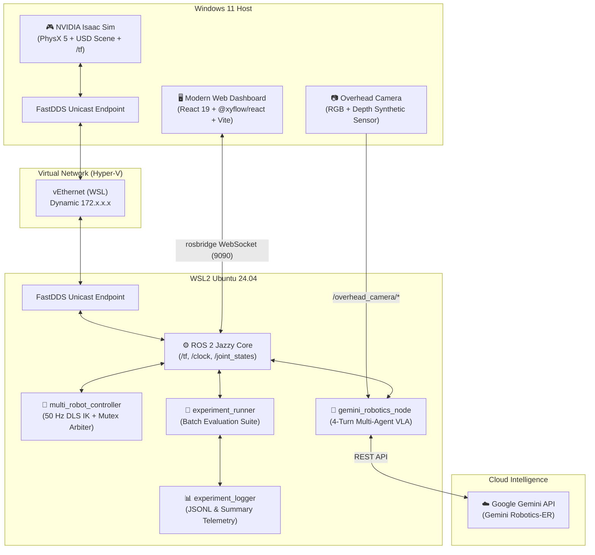

# Gemini Robotics ER × Isaac Sim — Multi-Robot Physical AI & VLA Manipulation

[](https://docs.ros.org/en/jazzy/)
[](https://developer.nvidia.com/isaac-sim)
[](https://www.python.org/)
[](https://react.dev/)
[](https://reactflow.dev/)
[](LICENSE)
[](https://deepmind.google/technologies/gemini/)

Three Franka FR3 robotic arms cooperatively manipulate objects and construct complex 3D structures in **NVIDIA Isaac Sim**, orchestrated by **Google Gemini Robotics-ER** via an agile multi-agent cognitive loop, tracked by an interactive **React Flow v12** digital twin, and validated with a publication-grade scientific evaluation suite.

<div align="center">
  
</div>


---

## ✨ Key Highlights

- **🤖 Multi-Robot Cooperative Manipulation (ATAMP)**:
  - **3-Arm Tower Construction**: 3 Franka FR3 robotic arms operate in a synchronized physical workspace, picking, transferring, and assembling structures with collision-free coordination.
  - **Dual-Arm Assembly Line**: Dynamically switches to an industrial conveyor setup where two FR3 robots perform Language-Driven Asymmetric Dual-Arm Grasping (LD-ADAG) on heavy chassis and long bars.
- **⚡ Dynamic Visual Servoing & Object Pooling**:
  - **Real-Time Conveyor Tracking**: ROS 2 continuous Cartesian tracking predicts and intercepts dynamically moving objects on a PhysX surface velocity conveyor.
  - **Zero-Overhead Memory Pools**: Infinite item stream simulation via background cyclic respawners without degrading RTF.
- **🧠 4-Turn Multi-Agent Brainstorming Architecture**:
  - **Spatial Architect (📐)**: Translates natural language missions into 2D ASCII Grid Chain-of-Thought (CoT) layouts and relative coordinate matrices.
  - **Agility & Performance Optimizer (⚡)**: Maximizes execution throughput and concurrency (`speed='fast'`), safely grounded in low-level ROS 2 hardware mutexes.
  - **Orchestrator (🦾)**: Synthesizes spatial plans and speed directives into parallel Function Calling dispatches.
- **🔀 Interactive React Flow v12 Workflow Graph**: Dynamic real-time visual canvas built on `@xyflow/react` v12, featuring custom glowing nodes for active agent personas, live robot arm telemetry (phase, utilization %, target), central table mutex locks, and animated particle flows.
- **🔬 Publication-Grade Scientific Benchmarking Suite**:
  - **7 Standardized Benchmark Scenarios** (S1–S7) covering primitive pick-and-place, cooperative towers, 3×3 grids, triangular pyramids, cross-table relays, and dynamic disturbance recovery.
  - **35+ Metrics** across task success (TSR, GCR), multi-robot coordination (Gini workload balance, mutex contention), physical accuracy, and VLA throughput.
  - **Automated Experiment Runner** (`experiment_runner.py`) & **LaTeX/Vector Plot Generator** (`analyze_experiments.py`) compiling ready-to-publish tables with 95% Wilson Score confidence intervals.
- **⚡ High-Speed Agile Motion Controller**: 50 Hz closed-loop control with Damped Least Squares (DLS) IK, Joint 1 Null-Space singularity avoidance, and tuned 20-step execution phases (0.4 s per motion segment).
- **📊 Claude Codex Switch (CCS) Digital Twin Dashboard**: Elegant dark-warm aesthetic (`#262624` background, `Crail` accents) with tabbed navigation:
  - `[🤖 Workflow Graph]` (Interactive React Flow canvas)
  - `[🗺️ 2D Workspace]` (Designtific auto-adapting XYFlow top-down map tracking dynamic objects)
  - `[⏱️ Gantt]` (Parallel execution and mutex contention timeline)
  - `[📈 KPIs & Trace]` (Resource utilization bars and discrete event table)
- **🚀 Dual Control Modes**: Switch seamlessly between the Gemini VLA reasoning engine and a standalone rule-based sequencer (no API required).
- **🌐 Cross-OS Bridge**: Automated FastDDS Unicast bridging between Windows 11 (Isaac Sim) and WSL2 Ubuntu 24.04 (ROS 2 Jazzy).

---

## 🏗️ Architecture



---

## 🧠 Multi-Agent Cognitive Pipeline

Rather than relying on a single monolithic prompt, the reasoning system employs an **adaptive 4-turn multi-agent collaboration loop**:

```
[ Operator Directive ] ➔ "Arrange all 9 blocks into a 3x3 coplanar grid"
         │
         ▼
[ Turn 2: Spatial Architect 📐 ]
   • Generates 2D ASCII Grid Chain-of-Thought representation
   • Formulates millimeter-accurate target coordinates (X, Y, Z, Yaw)
   • Utilizes `place_relative` for flexible geometric patterns
         │
         ▼
[ Turn 3: Agility & Performance Optimizer ⚡ ]
   • Inspects arm proximity and workload distribution
   • Recommends `speed='fast'` and bold parallel arm dispatches
   • Leverages low-level ROS 2 hardware mutexes for collision safety
         │
         ▼
[ Turn 4: Orchestrator & VLA Dispatcher 🦾 ]
   • Dispatches synchronized Function Calling actions (`pick`, `place`, `place_relative`)
   • Monitors real-time execution results and gripper touch sensors
```

---

## 🔬 Scientific Evaluation & Benchmarking Suite

Designed to support academic research papers in robotics and Physical AI (grounded in SayCan, RoCo, SMART-LLM, and BiGym methodologies):

### Standardized Benchmark Scenarios

| Scenario | Name | Blocks | Description | Coordination Challenge |
|---|---|:---:|---|---|
| **S1** | Primitive Pick & Place | 1 | Single-arm pick, transport, and place | Kinematic baseline & affordance |
| **S2** | Cooperative 3-Layer Tower | 3 | 3 robots each place 1 block sequentially | Decoupled pick, serialized placement |
| **S3** | Monolithic 9-Layer Tower | 9 | Complete 9-block tower construction | Shared workspace contention & height stability |
| **S4** | 3×3 Coplanar Square Grid | 9 | Planar matrix arrangement centered at origin | Spatial reasoning & ASCII CoT |
| **S5** | Coplanar Triangle / Pyramid | 6 | Triangular planar formation (3 base, 2 mid, 1 tip) | Non-cardinal relative placement offsets |
| **S6** | Cross-Table Staging & Relay | 2 | Handoffs between disjoint workspaces via center | Multi-stage dependency scheduling |
| **S7** | Dynamic Disturbance Recovery | 6 | Adversarial perturbation during stacking | Visual state verification & replanning |

### Running Benchmark Trials & Generating Paper Tables

```bash
# In WSL2 terminal with ROS 2 environment sourced:
source /opt/ros/jazzy/setup.bash
source ~/catkin_ws/install/setup.bash

# Run 20 automated trials across scenarios S1, S2, and S3
ros2 run isaac_ros2_control experiment_runner --scenarios S1,S2,S3 --trials 20

# Run full benchmark suite (all 7 scenarios)
ros2 run isaac_ros2_control experiment_runner --scenarios all --trials 20

# Run rule-based baseline comparison
ros2 run isaac_ros2_control experiment_runner --scenarios S1,S2,S3 --trials 20 --baseline

# Compile publication-ready LaTeX tables & PDF figures
ros2 run isaac_ros2_control analyze_experiments --log-dir /mnt/d/git/IsaacSim_GeminiRobotics/logs/experiments
```

Generated outputs include:
- `table1_success_rate.tex` — Task Success Rate (TSR) & Goal Condition Recall (GCR) with 95% Wilson Score confidence intervals.
- `table2_timing_breakdown.tex` — Mean ± std for makespan, planning latency, and physical motion time.
- `table3_robot_coordination.tex` — Multi-robot workload balance (Gini coefficient), pick/place success, and replan rates.
- `fig2_success_rate.pdf` & `fig3_utilization_heatmap.pdf` — High-resolution vector figures.

---

## 🎮 Web Dashboard & Digital Twin

A futuristic, high-performance web dashboard running at `http://localhost:5173`:

| Tab / View | Capabilities |
|---|---|
| **🔀 Workflow Graph** | Interactive `@xyflow/react` v12 canvas displaying the active goal, agent persona cards (Orchestrator 🦾, Spatial Architect 📐, Performance Optimizer ⚡), live robot arms (FR3_1, FR3_2, FR3_3 with phase and utilization), central mutex status, and animated particle flows. |
| **🗺️ 2D Workspace** | Top-down SVG digital twin tracking all 9 colored block tokens, 3 FR3 robot bases, reach envelopes, and the central target table in real time. |
| **⏱️ Enhanced Gantt** | High-precision timeline tracking parallel arm execution, pick/place phases, and shared workspace lock contention (mutex wait times). |
| **📊 KPIs & Trace** | Numerical robot resource utilization bars (busy/idle %), active state badges, and a discrete event table with duration calculations and one-click CSV export. |
| **💬 VLA Multi-Agent Chat** | Natural language and voice input (Web Speech API), glowing agent role badges, monospace formatting for spatial reasoning grids, and quick prompt chips. |
| **🛠️ Remote Control Bar** | Top navigation bar with one-click `Build` (`colcon build`), `Start`, `Stop`, and `Reset` controls. |

---

## 📐 Physical Workspace & Scene Layout

```text
                  [ Source Table 3 (FR3_3) ]
                     R=1.05m, θ=150°
                           │
                    [ FR3_3 Base ]
                     R=0.45m, θ=150°
                           │
[ Source Table 1 ] ──── [ FR3_1 Base ] ──── [ Center Target Table ] ──── [ FR3_2 Base ] ──── [ Source Table 2 ]
  R=1.05m, θ=270°      R=0.45m, θ=270°           R=0.0m              R=0.45m, θ=30°       R=1.05m, θ=30°
```

- **Main Workbench**: 2.8 × 2.8 × 0.20 m, centered at origin $(0, 0, 0)$
- **3 Robot Mounts**: Mounted at $R = 0.45\,\text{m}$ on the workbench ($Z = 0.20\,\text{m}$)
- **3 Source Tables**: 0.50 × 0.50 × 0.10 m at $R = 1.05\,\text{m}$ (behind each robot)
- **1 Target Table**: 0.36 × 0.36 × 0.10 m at the center ($R = 0.0\,\text{m}$)

### 9-Block Specifications

| Block | Assigned Robot | Geometric Shape | Color Label | Initial Position $(X, Y, Z)$ |
|---|:---:|:---:|:---:|:---:|
| `Block1` | FR3_1 | Cube | 🔴 Red | `[-0.12, -1.05, 0.33]` |
| `Block2` | FR3_1 | Cylinder | 🟢 Green | `[ 0.00, -1.15, 0.33]` |
| `Block3` | FR3_1 | Cube | 🔵 Blue | `[ 0.12, -1.05, 0.33]` |
| `Block4` | FR3_2 | Cylinder | 🟡 Yellow | `[ 0.81,  0.43, 0.33]` |
| `Block5` | FR3_2 | Cube | 🟣 Magenta | `[ 1.01,  0.48, 0.33]` |
| `Block6` | FR3_2 | Cylinder | 🔵 Cyan | `[ 0.91,  0.63, 0.33]` |
| `Block7` | FR3_3 | Cube | 🟠 Orange | `[-1.01,  0.48, 0.33]` |
| `Block8` | FR3_3 | Cylinder | 🟣 Purple | `[-0.81,  0.43, 0.33]` |
| `Block9` | FR3_3 | Cube | 🟢 Lime | `[-0.91,  0.63, 0.33]` |

---

<details>
<summary><h2>🧮 Control Algorithms & Kinematics (Click to Expand)</h2></summary>

### 1. Damped Least Squares (DLS) Inverse Kinematics
$$\mathbf{J}^\dagger = \mathbf{J}^T (\mathbf{J} \mathbf{J}^T + \lambda^2 \mathbf{I})^{-1}$$
$$\Delta \mathbf{q} = \mathbf{J}^\dagger \mathbf{e} + (\mathbf{I} - \mathbf{J}^\dagger \mathbf{J}) k_{\text{null}} (\mathbf{q}_{\text{home}} - \mathbf{q})$$

The null-space projection term keeps joints near their home configuration while tracking Cartesian end-effector targets, preventing joint limit saturation and kinematic singularities.

### 2. Tuned Agile Motion Dynamics
Motion execution velocity is controlled per phase segment at 50 Hz:
- **`fast`**: **20 steps** ($0.4\,\text{s}$ per phase segment) — recommended default for high agility.
- **`normal`**: **40 steps** ($0.8\,\text{s}$ per phase segment).
- **`slow`**: **70 steps** ($1.4\,\text{s}$ per phase segment).

### 3. Dual-Safety Dynamic Stacking Height
Guarantees collision-free placement even during sensor latency:
$$\text{target\_z} = \max(\text{tf\_place\_z},\;\text{base\_place\_z})$$
$$\text{base\_place\_z} = Z_{\text{table}} + Z_{\text{half\_block}} + 0.005 + (\text{tower\_height} \times 0.06)$$

### 4. Workspace Collision Mutex
The central workbench zone is protected by an atomic mutex lock in `multi_robot_controller.py`:
- Before descending into the shared workspace, a robot arm must acquire `center_occupied_by`.
- When contending, the waiting robot safely hovers at clearance height ($Z = 0.35\,\text{m}$), recording contention events for logging.
- Mutexes are cleared upon lifting or returning home.

</details>

---

## 🚀 Quick Start Guide

### Prerequisites
- **OS**: Windows 10 or 11 with WSL2 enabled.
- **GPU**: NVIDIA RTX 3060+ (8 GB+ VRAM).
- **RAM**: 16 GB minimum (32 GB recommended).
- **Disk**: 50 GB free space.
- **Node.js**: 18+ installed on Windows.
- **Gemini API Key**: Free tier from [Google AI Studio](https://aistudio.google.com/apikey).

### Step 1: Clone the Repository
```bash
git clone https://github.com/mincasurong/IsaacSim_GeminiRobotics.git
cd IsaacSim_GeminiRobotics
```

### Step 2: Set Up WSL2 & ROS 2 Jazzy
In PowerShell as Administrator:
```powershell
wsl --install -d Ubuntu-24.04
```
Then inside the WSL2 terminal:
```bash
cd /mnt/d/git/IsaacSim_GeminiRobotics/wsl_ws
chmod +x setup_all.sh
./setup_all.sh
```

### Step 3: Configure Gemini API Key
```bash
# In the repository root on Windows
cp .env.example private/.env
```
Edit `private/.env` and paste your key:
```env
GEMINI_API_KEY=your_actual_api_key_here
ROBOTICS_MODEL=gemini-2.5-flash
```

### Step 4: Build the Web Dashboard
```bash
cd gemini_web_gui
npm install
npm run build
```

### Step 5: Launch the System!
1. **Start Dashboard**: Double-click `scripts/start_dashboard.bat` (or run `launcher.bat`). Your browser opens to `http://localhost:5173`. Click **▶ Start**.
2. **Start Simulation**: In Isaac Sim, open `isaacsim_scripts/three_robot_tower.py` and press **▶ Play**.
3. **Execute**: Click any Quick Prompt chip (e.g. `⚡ Fast 9-Layer Tower` or `📐 3x3 Coplanar Grid`) or type a custom command!

---

## 📂 Repository Structure

```text
IsaacSim_Gemini/
├── .env.example                      # Template environment file
├── fastdds_profile.xml               # Dynamic FastDDS unicast network profile
├── launcher.bat                      # One-click Windows launch menu
├── LICENSE                           # Apache 2.0 open-source license
├── README.md                         # Main repository documentation
├── docs/                             # Developer guides & release history
│   ├── CHANGELOG.md                  # Semantic Versioning release notes
│   ├── CONTRIBUTING.md               # Open-source contribution guidelines
│   ├── DEVELOPMENT.md                # In-depth architectural & developer guide
│   └── QUICKSTART.md                 # Step-by-step onboarding walkthrough
├── gemini_web_gui/                   # Modern React 19 + @xyflow/react web GUI
│   ├── src/
│   │   ├── components/
│   │   │   ├── AgentWorkflowGraph.tsx # Interactive React Flow v12 canvas
│   │   │   ├── GanttChart.tsx        # Execution & mutex contention timeline
│   │   │   ├── KpiDashboard.tsx      # Utilization & state tracking
│   │   │   ├── SceneMap.tsx          # 2D SVG digital twin
│   │   │   ├── EventTrace.tsx        # Discrete event table & CSV export
│   │   │   └── theme.ts              # Obsidian glassmorphic styling tokens
│   │   ├── App.tsx                   # Main dashboard application
│   │   └── main.tsx                  # Vite entry point
│   ├── server.cjs                    # Express gateway with SSE streaming
│   └── package.json                  # Frontend dependencies
├── isaacsim_scripts/                 # Standalone NVIDIA Isaac Sim scene scripts
│   ├── three_robot_tower.py          # Primary 3x FR3 multi-robot simulation
│   └── assemble_industrial_mobile_manipulator.py # Carter + FR3 mobile manipulation
├── logs/experiments/                 # Benchmarking outputs & paper artifacts
│   ├── raw/                          # High-frequency JSONL telemetry traces
│   ├── summaries/                    # Aggregated CSV experiment summaries
│   ├── tables/                       # Generated publication LaTeX tables (.tex)
│   └── figures/                      # Generated publication vector plots (.pdf)
├── scripts/                          # Utility & automation launch scripts
│   ├── start_dashboard.bat           # Launcher for Web GUI & Express server
│   └── setup_fastdds_wsl.py          # Automatic IP discovery & FastDDS config
└── wsl_ws/                           # ROS 2 Jazzy workspace
    ├── bringup.bash                  # Auto-sync, build, and launch orchestrator
    ├── setup_all.sh                  # Automated WSL2 environment bootstrapper
    └── src/isaac_ros2_control/       # Core ROS 2 package
        ├── isaac_ros2_control/
        │   ├── analyze_experiments.py # Statistical analysis & LaTeX compiler
        │   ├── experiment_logger.py   # Telemetry logger (35+ metrics)
        │   ├── experiment_runner.py   # Batch trial runner for S1–S7 scenarios
        │   ├── experiment_scenarios.py# Scenario specifications & ground-truth TF
        │   ├── gemini_prompts.py      # Spatial & agility multi-agent prompts
        │   ├── gemini_robotics_node.py# 4-turn multi-agent VLA reasoning engine
        │   ├── gemini_tools.py        # Function calling schemas (pick, place, etc.)
        │   ├── kinematics.py          # Damped Least Squares IK & Null-Space solver
        │   ├── multi_robot_controller.py # 50 Hz controller & mutex arbiter
        │   └── workspace_state.py     # Real-time TF block distance tracking
        └── setup.py                   # ROS 2 package setup
```

---

## 🔧 Troubleshooting

| Issue | Probable Cause | Recommended Resolution |
|---|---|---|
| `TF_OLD_DATA ignoring data from past` | ROS 2 nodes using wall-clock time or zombie `kit.exe` instances running | Ensure `use_sim_time: True` is set. Terminate zombie simulator processes in PowerShell: `Stop-Process -Name "kit" -Force`. |
| `Frame with name ... already exists` | Multiple FR3 arms sharing default link names | Verify `isaac:nameOverride` is active via `configure_robot_tf_names` before starting simulation. |
| `This app can't run on your PC` | Windows batch file contains UTF-8 BOM encoding | Re-save the `.bat` file with clean ASCII or UTF-8 without BOM encoding and CRLF endings. |
| Robot arm hovers above block without descending | Central table mutex held by another arm | Normal collision prevention behavior; the arm will descend as soon as the active arm clears the shared zone. |
| WebSocket connection failed on port 9090 | `rosbridge_websocket` server not launched in WSL2 | Ensure `ros2 launch isaac_ros2_control multi_robot.launch.py` has started in WSL2. |

---

## 📖 Documentation Index

- 📘 **[Quick Start Guide](docs/QUICKSTART.md)**: Detailed step-by-step setup and verification.
- 🛠️ **[Development Guide](docs/DEVELOPMENT.md)**: In-depth technical architecture, kinematics, and contributor workflows.
- 🎮 **[Web Dashboard Guide](gemini_web_gui/README.md)**: React Flow visualizer, digital twin components, and API specs.
- 📜 **[Changelog](docs/CHANGELOG.md)**: Full release history and semantic versioning logs.
- 🤝 **[Contributing Guidelines](docs/CONTRIBUTING.md)**: How to file issues, submit PRs, and develop new features.
- 📄 **[License](LICENSE)**: Apache 2.0 open-source license.

---

## 🤝 Contributing

Contributions from the robotics and Physical AI open-source community are warmly welcome! Please review [CONTRIBUTING.md](docs/CONTRIBUTING.md) for instructions on proposing features, submitting bug reports, and submitting pull requests.

---

## 📄 License

This repository is distributed under the **Apache License 2.0**. See the [LICENSE](LICENSE) file for complete terms.

---

## 🙏 Acknowledgments

- **[Google DeepMind](https://deepmind.google/technologies/gemini/)** — Gemini Robotics-ER Vision-Language-Action foundation models.
- **[NVIDIA Isaac Sim](https://developer.nvidia.com/isaac-sim)** — PhysX 5 robotics simulation and Omniverse platform.
- **[Franka Emika](https://www.franka.de/)** — FR3 research manipulator kinematics and URDF models.
- **[ROS 2 Community](https://www.ros.org/)** — Open-source robot operating system middleware.
