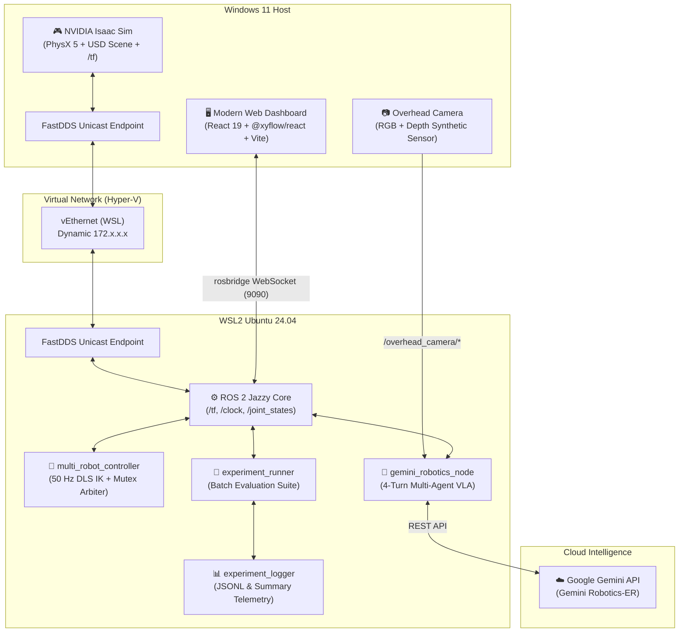

# Gemini Robotics ER × Isaac Sim — Multi-Robot Physical AI & VLA Manipulation

[](https://docs.ros.org/en/jazzy/)
[](https://developer.nvidia.com/isaac-sim)
[](https://www.python.org/)
[](https://react.dev/)
[](https://reactflow.dev/)
[](LICENSE)
[](https://deepmind.google/technologies/gemini/)

Three Franka FR3 robotic arms cooperatively manipulate objects and construct complex 3D structures in **NVIDIA Isaac Sim**, orchestrated by **Google Gemini Robotics-ER** via an agile multi-agent cognitive loop, tracked by an interactive **React Flow v12** digital twin, and validated with a publication-grade scientific evaluation suite.

<div align="center">
  
</div>


---

## ✨ Key Highlights

- **🤖 Multi-Robot Cooperative Manipulation (ATAMP)**:
  - **3-Arm Tower Construction**: 3 Franka FR3 robotic arms operate in a synchronized physical workspace, picking, transferring, and assembling structures with collision-free coordination.
  - **Dual-Arm Assembly Line**: Dynamically switches to an industrial conveyor setup where two FR3 robots perform Language-Driven Asymmetric Dual-Arm Grasping (LD-ADAG) on heavy chassis and long bars.
- **⚡ Dynamic Visual Servoing & Object Pooling**:
  - **Real-Time Conveyor Tracking**: ROS 2 continuous Cartesian tracking predicts and intercepts dynamically moving objects on a PhysX surface velocity conveyor.
  - **Zero-Overhead Memory Pools**: Infinite item stream simulation via background cyclic respawners without degrading RTF.
- **🧠 4-Turn Multi-Agent Brainstorming Architecture**:
  - **Spatial Architect (📐)**: Translates natural language missions into 2D ASCII Grid Chain-of-Thought (CoT) layouts and relative coordinate matrices.
  - **Agility & Performance Optimizer (⚡)**: Maximizes execution throughput and concurrency (`speed='fast'`), safely grounded in low-level ROS 2 hardware mutexes.
  - **Orchestrator (🦾)**: Synthesizes spatial plans and speed directives into parallel Function Calling dispatches.
- **🔀 Interactive React Flow v12 Workflow Graph**: Dynamic real-time visual canvas built on `@xyflow/react` v12, featuring custom glowing nodes for active agent personas, live robot arm telemetry (phase, utilization %, target), central table mutex locks, and animated particle flows.
- **🔬 Publication-Grade Scientific Benchmarking Suite**:
  - **7 Standardized Benchmark Scenarios** (S1–S7) covering primitive pick-and-place, cooperative towers, 3×3 grids, triangular pyramids, cross-table relays, and dynamic disturbance recovery.
  - **35+ Metrics** across task success (TSR, GCR), multi-robot coordination (Gini workload balance, mutex contention), physical accuracy, and VLA throughput.
  - **Automated Experiment Runner** (`experiment_runner.py`) & **LaTeX/Vector Plot Generator** (`analyze_experiments.py`) compiling ready-to-publish tables with 95% Wilson Score confidence intervals.
- **⚡ High-Speed Agile Motion Controller**: 50 Hz closed-loop control with Damped Least Squares (DLS) IK, Joint 1 Null-Space azimuth decoupling, state-gated mutual exclusion (`CENTER_WORKSPACE_STATES`), and tuned 20-step execution phases (0.4 s per motion segment).
- **📊 Claude Codex Switch (CCS) Digital Twin Dashboard**: Elegant dark-warm aesthetic (`#09090b` background, high-contrast accents) with tabbed navigation:
  - `[🤖 Workflow Graph]` (Interactive React Flow v12 canvas with live agent reasoning)
  - `[🗺️ 2D Workspace]` (Analytical metric digital twin with real-time 9-block TF tracking, arm heading needles, and layer badges)
  - `[⏱️ Gantt]` (Parallel execution and mutex contention timeline)
  - `[📈 KPIs & Trace]` (Resource utilization bars and discrete event table)
- **🔌 Native Model Context Protocol (MCP)**: Built-in ROS 2 Jazzy MCP server (`wsl_ws/scripts/ros2_mcp.py` + `opencode.json`) allowing AI coding agents to introspect live nodes, echo topics, and monitor simulation health.
- **🚀 Dual Control Modes**: Switch seamlessly between the Gemini VLA reasoning engine and a standalone rule-based sequencer (no API required).
- **🌐 Cross-OS Bridge**: Automated FastDDS Unicast bridging between Windows 11 (Isaac Sim) and WSL2 Ubuntu 24.04 (ROS 2 Jazzy).

---

## 🏗️ Architecture


```mermaid
graph TD
    subgraph "Windows 11 Host"
        IS["🎮 NVIDIA Isaac Sim<br/>(PhysX 5 + USD Scene + /tf)"]
        CAM["📷 Overhead Camera<br/>(RGB + Depth Synthetic Sensor)"]
        GUI["🖥️ Modern Web Dashboard<br/>(React 19 + @xyflow/react + Vite)"]
        FW["FastDDS Unicast Endpoint"]
    end

    subgraph "Virtual Network (Hyper-V)"
        VNet["vEthernet (WSL)<br/>Dynamic 172.x.x.x"]
    end

    subgraph "WSL2 Ubuntu 24.04"
        ROS["⚙️ ROS 2 Jazzy Core<br/>(/tf, /clock, /joint_states)"]
        MRC["🦾 multi_robot_controller<br/>(50 Hz DLS IK + Mutex Arbiter)"]
        VLM["🧠 gemini_robotics_node<br/>(4-Turn Multi-Agent VLA)"]
        EXP["🔬 experiment_runner<br/>(Batch Evaluation Suite)"]
        LOG["📊 experiment_logger<br/>(JSONL & Summary Telemetry)"]
        DDS["FastDDS Unicast Endpoint"]
    end

    subgraph "Cloud Intelligence"
        GEM["☁️ Google Gemini API<br/>(Gemini Robotics-ER)"]
    end

    IS <--> FW
    FW <--> VNet
    VNet <--> DDS
    DDS <--> ROS
    CAM -->|"/overhead_camera/*"| VLM
    ROS <--> MRC
    ROS <--> VLM
    ROS <--> EXP
    EXP <--> LOG
    GUI <-->|"rosbridge WebSocket (9090)"| ROS
    VLM <-->|"REST API"| GEM
```

---

## 🧠 Multi-Agent Cognitive Pipeline

Rather than relying on a single monolithic prompt, the reasoning system employs an **adaptive 4-turn multi-agent collaboration loop**:

```
[ Operator Directive ] ➔ "Arrange all 9 blocks into a 3x3 coplanar grid"
         │
         ▼
[ Turn 2: Spatial Architect 📐 ]
   • Generates 2D ASCII Grid Chain-of-Thought representation
   • Formulates millimeter-accurate target coordinates (X, Y, Z, Yaw)
   • Utilizes `place_relative` for flexible geometric patterns
         │
         ▼
[ Turn 3: Agility & Performance Optimizer ⚡ ]
   • Inspects arm proximity and workload distribution
   • Recommends `speed='fast'` and bold parallel arm dispatches
   • Leverages low-level ROS 2 hardware mutexes for collision safety
         │
         ▼
[ Turn 4: Orchestrator & VLA Dispatcher 🦾 ]
   • Dispatches synchronized Function Calling actions (`pick`, `place`, `place_relative`)
   • Monitors real-time execution results and gripper touch sensors
```

---

## 🔬 Scientific Evaluation & Benchmarking Suite

Designed to support academic research papers in robotics and Physical AI (grounded in SayCan, RoCo, SMART-LLM, and BiGym methodologies):

### Standardized Benchmark Scenarios

| Scenario | Name | Blocks | Description | Coordination Challenge |
|---|---|:---:|---|---|
| **S1** | Primitive Pick & Place | 1 | Single-arm pick, transport, and place | Kinematic baseline & affordance |
| **S2** | Cooperative 3-Layer Tower | 3 | 3 robots each place 1 block sequentially | Decoupled pick, serialized placement |
| **S3** | Monolithic 9-Layer Tower | 9 | Complete 9-block tower construction | Shared workspace contention & height stability |
| **S4** | 3×3 Coplanar Square Grid | 9 | Planar matrix arrangement centered at origin | Spatial reasoning & ASCII CoT |
| **S5** | Coplanar Triangle / Pyramid | 6 | Triangular planar formation (3 base, 2 mid, 1 tip) | Non-cardinal relative placement offsets |
| **S6** | Cross-Table Staging & Relay | 2 | Handoffs between disjoint workspaces via center | Multi-stage dependency scheduling |
| **S7** | Dynamic Disturbance Recovery | 6 | Adversarial perturbation during stacking | Visual state verification & replanning |

### Running Benchmark Trials & Generating Paper Tables

```bash
# In WSL2 terminal with ROS 2 environment sourced:
source /opt/ros/jazzy/setup.bash
source ~/catkin_ws/install/setup.bash

# Run 20 automated trials across scenarios S1, S2, and S3
ros2 run isaac_ros2_control experiment_runner --scenarios S1,S2,S3 --trials 20

# Run full benchmark suite (all 7 scenarios)
ros2 run isaac_ros2_control experiment_runner --scenarios all --trials 20

# Run rule-based baseline comparison
ros2 run isaac_ros2_control experiment_runner --scenarios S1,S2,S3 --trials 20 --baseline

# Compile publication-ready LaTeX tables & PDF figures
ros2 run isaac_ros2_control analyze_experiments --log-dir /mnt/d/git/IsaacSim_GeminiRobotics/logs/experiments
```

Generated outputs include:
- `table1_success_rate.tex` — Task Success Rate (TSR) & Goal Condition Recall (GCR) with 95% Wilson Score confidence intervals.
- `table2_timing_breakdown.tex` — Mean ± std for makespan, planning latency, and physical motion time.
- `table3_robot_coordination.tex` — Multi-robot workload balance (Gini coefficient), pick/place success, and replan rates.
- `fig2_success_rate.pdf` & `fig3_utilization_heatmap.pdf` — High-resolution vector figures.

---

## 🎮 Web Dashboard & Digital Twin

A futuristic, high-performance web dashboard running at `http://localhost:5173`:

| Tab / View | Capabilities |
|---|---|
| **🔀 Workflow Graph** | Interactive `@xyflow/react` v12 canvas displaying the active goal, agent persona cards (Orchestrator 🦾, Spatial Architect 📐, Performance Optimizer ⚡), live robot arms (FR3_1, FR3_2, FR3_3 with phase and utilization), central mutex status, and animated particle flows. |
| **🗺️ 2D Workspace** | Analytical top-down digital twin projecting physical workspace coordinates ($S = 220\,\text{px/m}$) onto an interactive React Flow canvas. Features live TF tracking of all 9 blocks (`TABLE_1/2/3`, `HELD`, `STACKED`), rotating arm heading needles reflecting Link 1 Z orientation, stacked layer elevation badges (`L1`–`L9`), and active task laser beams. |
| **⏱️ Enhanced Gantt** | High-precision timeline tracking parallel arm execution, pick/place phases, and shared workspace lock contention (mutex wait times). |
| **📊 KPIs & Trace** | Numerical robot resource utilization bars (busy/idle %), active state badges, and a discrete event table with duration calculations and one-click CSV export. |
| **💬 VLA Multi-Agent Chat** | Natural language and voice input (Web Speech API), glowing agent role badges, monospace formatting for spatial reasoning grids, and quick prompt chips. |
| **🛠️ Remote Control Bar** | Top navigation bar with one-click `Build` (`colcon build`), `Start`, `Stop`, and `Reset` controls. |

---

## 📐 Physical Workspace & Kinematic Cell Topology

```text
                  [ Source Table 3 (FR3_3) ]
                     R=1.05m, θ=150°
                           │
                    [ FR3_3 Base ]
                 R=0.45m, Yaw=42.0°
                           │
[ Source Table 1 ] ──── [ FR3_1 Base ] ──── [ Center Target Table ] ──── [ FR3_2 Base ] ──── [ Source Table 2 ]
  R=1.05m, θ=270°     R=0.45m, Yaw=168°           R=0.0m           R=0.45m, Yaw=-64°    R=1.05m, θ=30°
```

### Robot Base Mounts & Tangential Orientations
The Franka FR3 manipulator has a mechanical limit of $[-2.8973, +2.8973]\,\text{rad}$ ($\pm 166.004^\circ$) on Joint 1, producing a physical **$28^\circ$ blind zone** directly behind the base. To eliminate joint limit clipping and avoid arm collisions:
- **`FR3_1` (Bottom)**: Mounted at `[0.0, -0.45, 0.20]m`, Base Yaw = **`168.0°`** (Center Table: local $-78^\circ$, Source Table 1: local $+102^\circ$).
- **`FR3_2` (Top-Right)**: Mounted at `[0.3897, 0.225, 0.20]m`, Base Yaw = **`-64.0°`** (Center Table: local $-86^\circ$, Source Table 2: local $+94^\circ$).
- **`FR3_3` (Top-Left)**: Mounted at `[-0.3897, 0.225, 0.20]m`, Base Yaw = **`42.0°`** (Center Table: local $-72^\circ$, Source Table 3: local $+108^\circ$).
- **Collision-Free Standby Posture**: In home configuration ($\mathbf{q}_{\text{home}} = [0, 0, 0, -1.57, 0, 1.57, 0.79]$), Joint 1 rests at neutral ($0.0\,\text{rad}$), pointing each arm outward along its base azimuth, maintaining $>65^\circ$ reach margin to all targets without mutual arm contention.

### Workspace Specifications
- **Main Workbench**: 2.8 × 2.8 × 0.20 m, centered at origin $(0, 0, 0)$
- **3 Source Tables**: 0.50 × 0.50 × 0.10 m at $R = 1.05\,\text{m}$ (behind each robot)
- **1 Central Target Table**: 0.36 × 0.36 × 0.10 m at the center ($R = 0.0\,\text{m}$)
- **Physics Stacking Surface**: $Z_{\text{table\_top}} = 0.30\,\text{m}$

### 9-Block Specifications

| Block | Assigned Robot | Geometric Shape | Color Label | Initial Position $(X, Y, Z)$ |
|---|:---:|:---:|:---:|:---:|
| `Block1` | FR3_1 | Cube (4.5cm) | 🔴 Red | `[-0.12, -1.05, 0.33]` |
| `Block2` | FR3_1 | Cylinder (4.5cm) | 🟢 Green | `[ 0.00, -1.15, 0.33]` |
| `Block3` | FR3_1 | Cube (4.5cm) | 🔵 Blue | `[ 0.12, -1.05, 0.33]` |
| `Block4` | FR3_2 | Cylinder (4.5cm) | 🟡 Yellow | `[ 0.81,  0.43, 0.33]` |
| `Block5` | FR3_2 | Cube (4.5cm) | 🟣 Magenta | `[ 1.01,  0.48, 0.33]` |
| `Block6` | FR3_2 | Cylinder (4.5cm) | 🔵 Cyan | `[ 0.91,  0.63, 0.33]` |
| `Block7` | FR3_3 | Cube (4.5cm) | 🟠 Orange | `[-1.01,  0.48, 0.33]` |
| `Block8` | FR3_3 | Cylinder (4.5cm) | 🟣 Purple | `[-0.81,  0.43, 0.33]` |
| `Block9` | FR3_3 | Cube (4.5cm) | 🟢 Lime | `[-0.91,  0.63, 0.33]` |

---

<details>
<summary><h2>🧮 Control Algorithms & Kinematics (Click to Expand)</h2></summary>

### 1. Damped Least Squares (DLS) IK with Null-Space Azimuth Decoupling
$$\mathbf{J}^\dagger = \mathbf{J}^T (\mathbf{J} \mathbf{J}^T + \lambda^2 \mathbf{I})^{-1}$$
$$\Delta \mathbf{q} = \mathbf{J}^\dagger \mathbf{e} + (\mathbf{I} - \mathbf{J}^\dagger \mathbf{J}) \nabla \Phi(\mathbf{q})$$

To prevent Joint 1 azimuth fighting when reaching between source tables ($q_1 \approx -\pi/2$) and the central target ($q_1 \approx +\pi/2$), the null-space posture gradient decouples Joint 1:
$$\nabla \Phi(\mathbf{q}) = \mathbf{k}_{\text{null}} \odot (\mathbf{q}_{\text{home}} - \mathbf{q}), \quad \text{with } \nabla \Phi(\mathbf{q})_1 \equiv 0$$
Joint 1 is driven purely by task-space Cartesian tracking, eliminating internal posture counter-torques.

### 2. State-Gated Spatial Mutual Exclusion
To eliminate mid-air collisions while maximizing execution concurrency, the shared central workspace is governed by a state-gated lock:
$$\mathcal{S}_{\text{center}} = \{\text{TUCK\_AFTER\_PICK}, \text{ROTATE\_TO\_PLACE}, \text{HOVER\_PLACE}, \text{DESCEND\_PLACE}, \text{RELEASE}, \text{RETRACT}, \text{TUCK\_AFTER\_PLACE}, \text{RETURN\_HOME}\}$$
A robot entering `WAIT_FOR_CENTER` may only claim the zone when:
$$\text{IsFree}(i) \iff (\text{lock} \in \{\varnothing, i\}) \land \bigwedge_{j \neq i} \big( \text{state}_j \notin \mathcal{S}_{\text{center}} \big)$$
The lock is held through the entirety of `RETURN_HOME` until the manipulator physically clears the table perimeter.

### 3. Precision Zero-Drop Anti-Bounce Stacking
Dropping blocks from clearance offsets ($+5\,\text{mm}$) causes contact restitution impulses that destabilize tall towers ($N \ge 4$). The controller commands descent directly to the continuous contact coordinate:
$$Z_{\text{target}} = Z_{\text{table\_top}} (0.30\,\text{m}) + \left(N - \frac{1}{2}\right) H_{\text{block}} (0.06\,\text{m})$$
holding nominal joint waypoints during `RELEASE` before vertically retracting.

### 4. Windowed Physical Grasp Verification & Dwell Dynamics
Franka parallel fingers require $250$–$350\,\text{ms}$ under PhysX dynamic joint drive compliance to establish normal grip force. The controller enforces `dwell_steps = 15` ($300\,\text{ms}$ at 50 Hz), followed by a windowed gap check:
$$\text{pick\_success} \iff 0.005\,\text{m} < d_{\text{finger}} < 0.038\,\text{m}$$
Rejecting both empty-hand under-travel ($< 5\,\text{mm}$) and unactuated open over-travel ($> 38\,\text{mm}$).

### 5. Tuned Agile Motion Dynamics
Motion execution velocity is controlled per phase segment using quintic polynomial minimum-jerk interpolation at 50 Hz:
- **`fast`**: **20 steps** ($0.4\,\text{s}$ per segment) — default for agile manipulation.
- **`normal`**: **40 steps** ($0.8\,\text{s}$ per segment).
- **`slow`**: **70 steps** ($1.4\,\text{s}$ per segment).

</details>

---

## 🚀 Quick Start Guide

### Prerequisites
- **OS**: Windows 10 or 11 with WSL2 enabled.
- **GPU**: NVIDIA RTX 3060+ (8 GB+ VRAM).
- **RAM**: 16 GB minimum (32 GB recommended).
- **Disk**: 50 GB free space.
- **Node.js**: 18+ installed on Windows.
- **Gemini API Key**: Free tier from [Google AI Studio](https://aistudio.google.com/apikey).

### Step 1: Clone the Repository
```bash
git clone https://github.com/mincasurong/IsaacSim_GeminiRobotics.git
cd IsaacSim_GeminiRobotics
```

### Step 2: Set Up WSL2 & ROS 2 Jazzy
In PowerShell as Administrator:
```powershell
wsl --install -d Ubuntu-24.04
```
Then inside the WSL2 terminal:
```bash
cd /mnt/d/git/IsaacSim_GeminiRobotics/wsl_ws
chmod +x setup_all.sh
./setup_all.sh
```

### Step 3: Configure Gemini API Key
```bash
# In the repository root on Windows
cp .env.example private/.env
```
Edit `private/.env` and paste your key:
```env
GEMINI_API_KEY=your_actual_api_key_here
ROBOTICS_MODEL=gemini-3.8-flash
```

### Step 4: Build the Web Dashboard
```bash
cd gemini_web_gui
npm install
npm run build
```

### Step 5: Launch the System!
1. **Start Dashboard**: Double-click `scripts/start_dashboard.bat` (or run `launcher.bat`). Your browser opens to `http://localhost:5173`. Click **▶ Start**.
2. **Start Simulation**: In Isaac Sim, open `isaacsim_scripts/three_robot_tower.py` and press **▶ Play**.
3. **Execute**: Click any Quick Prompt chip (e.g. `⚡ Fast 9-Layer Tower` or `📐 3x3 Coplanar Grid`) or type a custom command!

---

## 📂 Repository Structure

```text
IsaacSim_Gemini/
├── .env.example                      # Template environment file
├── .gitattributes                    # Git LFS & line ending rules
├── .gitignore                        # Standard git ignores (build artifacts, secrets)
├── LICENSE                           # Apache 2.0 open-source license
├── opencode.json                     # OpenCode Agent & ROS 2 MCP configuration
├── README.md                         # Main repository documentation & guide
├── .agent/skills/                    # Local specialized agent skills
│   ├── multi-robot-motion-planning/  # Kinematics, reachability & mutual exclusion
│   ├── isaacsim-troubleshooting/     # Cross-OS FastDDS, TF & PhysX troubleshooting
│   └── system_designer/              # System extension & layer design guidelines
├── docs/                             # Developer guides & release history
│   ├── CHANGELOG.md                  # Semantic Versioning release notes
│   ├── CONTRIBUTING.md               # Open-source contribution guidelines
│   ├── DEVELOPMENT.md                # In-depth architectural & developer guide
│   ├── LESSONS_LEARNED_2026-09-30.md # Detailed algorithmic failure analyses & fixes
│   └── QUICKSTART.md                 # Step-by-step onboarding walkthrough
├── gemini_web_gui/                   # Modern React 19 + @xyflow/react web GUI
│   ├── src/
│   │   ├── components/
│   │   │   ├── AgentWorkflowGraph.tsx # Interactive React Flow v12 reasoning graph
│   │   │   ├── GanttChart.tsx        # Execution & mutex contention timeline
│   │   │   ├── KpiDashboard.tsx      # Utilization & state tracking
│   │   │   ├── SceneMap.tsx          # 2D Metric Digital Twin with live block TF
│   │   │   ├── EventTrace.tsx        # Discrete event table & CSV export
│   │   │   └── theme.ts              # Theme tokens & telemetry types
│   │   ├── App.tsx                   # Main dashboard application
│   │   └── main.tsx                  # Vite entry point
│   ├── server.cjs                    # Express gateway with SSE streaming
│   └── package.json                  # Frontend dependencies
├── isaacsim_scripts/                 # Standalone NVIDIA Isaac Sim scene scripts
│   ├── three_robot_tower.py          # Primary 3x FR3 multi-robot simulation (Option 1)
│   ├── conveyor_dual_robot.py        # Dual-arm conveyor visual servoing (Option 5)
│   ├── assembly_dual_robot.py        # Long-horizon dual-arm assembly (Option 6)
│   └── assemble_industrial_mobile_manipulator.py # Carter + FR3 mobile manipulation
├── logs/experiments/                 # Benchmarking outputs & paper artifacts
│   ├── raw/                          # High-frequency JSONL telemetry traces
│   ├── summaries/                    # Aggregated CSV experiment summaries
│   ├── tables/                       # Generated publication LaTeX tables (.tex)
│   └── figures/                      # Generated publication vector plots (.pdf)
├── scripts/                          # Utility & automation launch scripts
│   ├── launcher.bat                  # Unified Windows menu launcher (Options 0-6)
│   ├── start_dashboard.bat           # Launcher for Web GUI & Express server
│   └── setup_fastdds_wsl.py          # Automatic IP discovery & FastDDS config
└── wsl_ws/                           # ROS 2 Jazzy workspace
    ├── bringup.bash                  # Auto-sync, build, and launch orchestrator
    ├── setup_all.sh                  # Automated WSL2 environment bootstrapper
    ├── scripts/
    │   └── ros2_mcp.py               # Model Context Protocol ROS 2 bridge
    └── src/
        ├── isaac_ros2_control/       # Core ROS 2 package
        │   ├── analyze_experiments.py # Statistical analysis & LaTeX compiler
        │   ├── conveyor_dual_controller.py # Dual FR3 conveyor controller
        │   ├── experiment_logger.py   # Telemetry logger (35+ metrics)
        │   ├── experiment_runner.py   # Batch trial runner for S1–S7 scenarios
        │   ├── experiment_scenarios.py# Scenario specifications & ground-truth TF
        │   ├── gemini_prompts.py      # Spatial, relay & agility multi-agent prompts
        │   ├── gemini_robotics_node.py# 4-turn multi-agent VLA reasoning engine
        │   ├── gemini_tools.py        # Function calling schemas (pick, place, etc.)
        │   ├── kinematics.py          # Damped Least Squares IK & Null-Space solver
        │   ├── multi_robot_controller.py # 50 Hz controller, TF tracking & mutex arbiter
        │   └── rule_based_verifier.py # Pre-execution deterministic safety verification
        ├── multi_robot_description/   # 3-arm unified URDF/Xacro descriptions
        └── multi_robot_moveit_config/ # MoveIt 2 OMPL / MoveItPy configuration
```

---

## 🔧 Troubleshooting

| Issue | Probable Cause | Recommended Resolution |
|---|---|---|
| `TF_OLD_DATA ignoring data from past` | ROS 2 nodes using wall-clock time or zombie `kit.exe` instances running | Ensure `use_sim_time: True` is set. Terminate zombie simulator processes in PowerShell: `Stop-Process -Name "kit" -Force`. |
| `Frame with name ... already exists` | Multiple FR3 arms sharing default link names | Verify `isaac:nameOverride` is active via `configure_robot_tf_names` before starting simulation. |
| `This app can't run on your PC` | Windows batch file contains UTF-8 BOM encoding | Re-save the `.bat` file with clean ASCII or UTF-8 without BOM encoding and CRLF endings. |
| Robot arm hovers above block without descending | Central table mutex held by another arm | Normal collision prevention behavior; the arm will descend as soon as the active arm clears the shared zone. |
| WebSocket connection failed on port 9090 | `rosbridge_websocket` server not launched in WSL2 | Ensure `ros2 launch isaac_ros2_control multi_robot.launch.py` has started in WSL2. |

---

## 📖 Documentation Index

- 📘 **[Quick Start Guide](docs/QUICKSTART.md)**: Detailed step-by-step setup and verification.
- 🛠️ **[Development Guide](docs/DEVELOPMENT.md)**: In-depth technical architecture, kinematics, and contributor workflows.
- 🎮 **[Web Dashboard Guide](gemini_web_gui/README.md)**: React Flow visualizer, digital twin components, and API specs.
- 📜 **[Changelog](docs/CHANGELOG.md)**: Full release history and semantic versioning logs.
- 🤝 **[Contributing Guidelines](docs/CONTRIBUTING.md)**: How to file issues, submit PRs, and develop new features.
- 📄 **[License](LICENSE)**: Apache 2.0 open-source license.

---

## 🤝 Contributing

Contributions from the robotics and Physical AI open-source community are warmly welcome! Please review [CONTRIBUTING.md](docs/CONTRIBUTING.md) for instructions on proposing features, submitting bug reports, and submitting pull requests.

---

## 📄 License

This repository is distributed under the **Apache License 2.0**. See the [LICENSE](LICENSE) file for complete terms.

---

## 🙏 Acknowledgments

- **[Google DeepMind](https://deepmind.google/technologies/gemini/)** — Gemini Robotics-ER Vision-Language-Action foundation models.
- **[NVIDIA Isaac Sim](https://developer.nvidia.com/isaac-sim)** — PhysX 5 robotics simulation and Omniverse platform.
- **[Franka Emika](https://www.franka.de/)** — FR3 research manipulator kinematics and URDF models.
- **[ROS 2 Community](https://www.ros.org/)** — Open-source robot operating system middleware.
