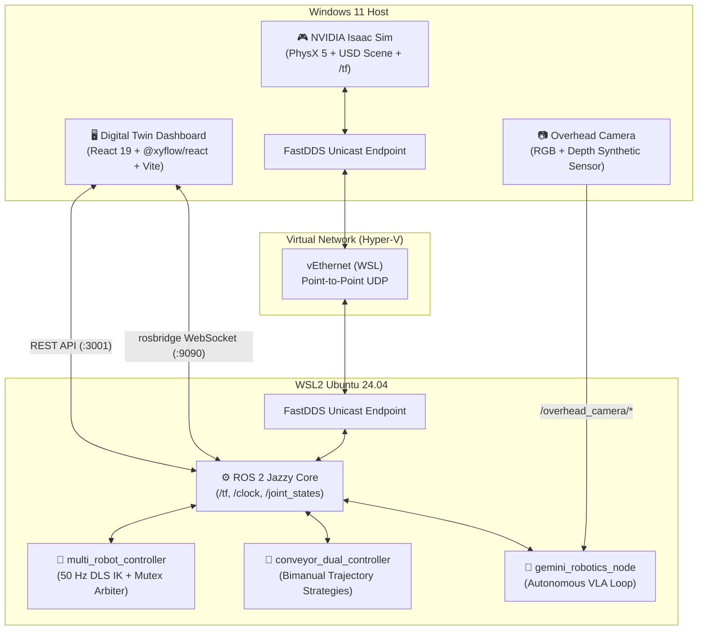

# Gemini Robotics ER × Isaac Sim — Multi-Robot Physical AI & VLA Manipulation

[](https://docs.ros.org/en/jazzy/)
[](https://developer.nvidia.com/isaac-sim)
[](https://deepmind.google/technologies/gemini/)
[](https://react.dev/)
[](https://reactflow.dev/)
[](LICENSE)

A multi-robot Physical AI manipulation station featuring **3× Franka FR3 robotic arms** in **NVIDIA Isaac Sim**, coordinated through a **Dual Execution Engine** (Zero-Token Visual Task Workflow Builder and Gemini Robotics VLA), tracked by a real-time **React Flow v12 Digital Twin**, and bridged via cross-platform **FastDDS Unicast**.

<div align="center">
  
</div>

---

## ✨ Core Capabilities

- **⚡ Dual Execution Engine**:
  - **🧩 Visual Flow Mode (Zero-Token)**: Full-screen node-based workflow builder (`@xyflow/react`). Point-and-click parallel task sequencing with **zero API token usage**, sub-millisecond dispatch, and hardware-in-the-loop completion verification.
  - **🧠 Autonomous VLA Mode**: Closed-loop visual-language-action reasoning powered by **Google Gemini Robotics-ER 2** and **Gemini 3.5 Flash-Lite** for natural language task execution and automated disturbance recovery.
- **🔀 True Parallel DAG Execution**:
  - Asynchronous wavefront scheduler executing independent robot actions concurrently (e.g. 3 arms picking simultaneously from separate source tables) and serializing only at shared physical resources (e.g. central assembly mutex).
  - Recessed frosted half-moon ports with magnetic snapping and inline `✕` edge removers for effortless visual wiring.
- **🦾 50 Hz Multi-Robot Kinematic Control**:
  - Damped Least Squares (DLS) Inverse Kinematics with null-space projection for singularity avoidance.
  - Spatial mutual exclusion arbiter (`center_occupied_by`) preventing arm collisions in the shared assembly zone.
  - Quintic polynomial trajectory generation with synchronized bimanual grasp constraints.
- **🏭 Multi-Workcell Operating Modes**:
  - **Mode 1 (3-Robot Tower Assembly)**: Coordinated 3-arm pick-and-place, staging relays, and multi-story tower stacking.
  - **Mode 5 (Dynamic Conveyor Cell)**: Real-time 30+ Hz visual tracking of moving conveyor items and synchronized dual-arm circular wave manipulation (`dual_arm_circle`).
  - **Mode 6 (Cooperative Sub-Assembly)**: Dual-arm component mating and multi-part staging.
- **🖥️ High-Tech Digital Twin Dashboard (`gemini_web_gui`)**:
  - Built with React 19, Vite, and TailwindCSS.
  - Real-time 2D workspace map with live TF coordinate projection and stacked elevation badges.
  - Gantt execution timeline, KPI telemetry, and system health monitoring.

---

## 🏗️ System Architecture


```mermaid
graph TD
    subgraph "Windows 11 Host"
        IS["🎮 NVIDIA Isaac Sim<br/>(PhysX 5 + USD Scene + /tf)"]
        CAM["📷 Overhead Camera<br/>(RGB + Depth Synthetic Sensor)"]
        GUI["🖥️ Digital Twin Dashboard<br/>(React 19 + @xyflow/react + Vite)"]
        FW["FastDDS Unicast Endpoint"]
    end

    subgraph "Virtual Network (Hyper-V)"
        VNet["vEthernet (WSL)<br/>Point-to-Point UDP"]
    end

    subgraph "WSL2 Ubuntu 24.04"
        ROS["⚙️ ROS 2 Jazzy Core<br/>(/tf, /clock, /joint_states)"]
        MRC["🦾 multi_robot_controller<br/>(50 Hz DLS IK + Mutex Arbiter)"]
        CDC["🔄 conveyor_dual_controller<br/>(Bimanual Trajectory Strategies)"]
        VLM["🧠 gemini_robotics_node<br/>(Autonomous VLA Loop)"]
        DDS["FastDDS Unicast Endpoint"]
    end

    IS <--> FW
    FW <--> VNet
    VNet <--> DDS
    DDS <--> ROS
    CAM -->|"/overhead_camera/*"| VLM
    ROS <--> MRC
    ROS <--> CDC
    ROS <--> VLM
    GUI <-->|"rosbridge WebSocket (:9090)"| ROS
    GUI <-->|"REST API (:3001)"| ROS
```

---

## 🚀 Quick Start

### 1. Prerequisites
- **OS**: Windows 11 with WSL2 (Ubuntu 24.04 LTS).
- **GPU**: NVIDIA RTX GPU with 8 GB+ VRAM.
- **Simulation**: NVIDIA Isaac Sim (4.5+ or 6.0).
- **Core**: ROS 2 Jazzy Jalisco, Node.js 18+.

### 2. WSL2 & ROS 2 Environment Setup
In WSL2 Ubuntu 24.04 terminal:
```bash
cd wsl_ws
chmod +x setup_all.sh
./setup_all.sh
```

### 3. Configure Environment
```bash
cp .env.example private/.env
```
Edit `private/.env` and configure your API key (if using VLA mode):
```env
GEMINI_API_KEY=your_gemini_api_key_here
PLANNER_MODEL=gemini-3.5-flash-lite
ROBOTICS_MODEL=gemini-robotics-er-2-preview
EXECUTION_MODE=visual_flow
```

### 4. Build Web GUI
```bash
cd gemini_web_gui
npm install
npm run build
```

### 5. Launch
1. **Start Simulation**: In Isaac Sim on Windows, run the desired scene script:
   - Mode 1: `isaacsim_scripts/three_robot_tower.py`
   - Mode 5: `isaacsim_scripts/conveyor_dual_robot.py`
2. **Start ROS 2 Controller**: In WSL2:
   ```bash
   ros2 launch isaac_ros2_control gemini_controller.launch.py
   ```
3. **Start Dashboard**:
   ```bash
   cd gemini_web_gui && npm run dev
   ```
   Open `http://localhost:5173` to access the visual task workflow canvas and digital twin.

---

## 📊 Workcell Operating Modes

| Mode | Scene Script | Active Robots | Key Feature |
| :---: | :--- | :--- | :--- |
| **1** | `three_robot_tower.py` | FR3_1, FR3_2, FR3_3 | 3-arm cooperative tower assembly & staging relay |
| **5** | `conveyor_dual_robot.py` | FR3_1, FR3_2 | Conveyor stream intercept & dual-arm LongBar manipulation |
| **6** | `assembly_dual_robot.py` | FR3_1, FR3_2 | Dual-arm cooperative assembly & component mating |

---

## 📜 License

This project is licensed under the Apache 2.0 License — see the [LICENSE](LICENSE) file for details.
