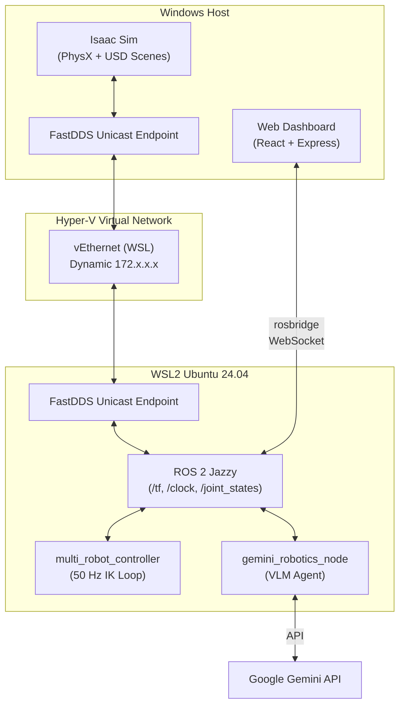
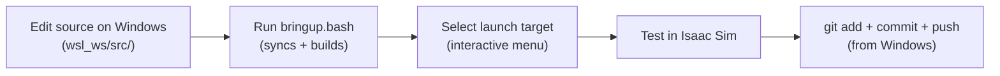

# Development Guide

This guide provides technical details, architecture overview, and setup instructions for developers and contributors.

---

## System Architecture

The project bridges **NVIDIA Isaac Sim** (Windows) with **ROS 2 Jazzy** (WSL2 Ubuntu 24.04) using a FastDDS Unicast channel.



### Responsibilities

| Component | Host | Role |
|-----------|------|------|
| Isaac Sim | Windows | Physics simulation, rendering, scene management, camera/sensor publishing |
| ROS 2 Nodes | WSL2 | Motion control, IK solving, task orchestration, VLM integration |
| Web Dashboard | Windows | User interface, log viewer, Gantt timeline, goal dispatch |
| FastDDS | Both | Cross-OS DDS communication via unicast XML profiles |

---

## Development Setup

### 1. Install Isaac Sim (Windows)

1. Install the [NVIDIA Omniverse Launcher](https://www.nvidia.com/en-us/omniverse/).
2. Install **Isaac Sim 4.5+** or **6.0** from the launcher.
3. Note the installation path (e.g., `C:\Users\<USER>\AppData\Local\ov\pkg\isaac-sim-4.5.0`).

### 2. Set Up WSL2 + ROS 2 Jazzy

```powershell
# Install WSL2 Ubuntu 24.04 (PowerShell as Admin)
wsl --install -d Ubuntu-24.04
```

```bash
# Inside WSL2 terminal
cd /mnt/d/git/IsaacSim_GeminiRobotics/wsl_ws
chmod +x setup_all.sh
./setup_all.sh
```

The setup script installs:
- ROS 2 Jazzy (`ros-jazzy-desktop`)
- Build tools (`colcon`, `rosdep`)
- Python dependencies (`google-genai`, `numpy`, `scipy`, `cv_bridge`)
- FastDDS unicast configuration

### 3. Configure Networking

WSL2 runs on a Hyper-V virtual NAT. Standard DDS multicast doesn't cross this boundary.

- **Firewall**: Open UDP ports 7400–7500 on the `vEthernet (WSL)` adapter.
- **FastDDS**: The launcher scripts automatically run `setup_fastdds_wsl.py` to generate unicast profiles with the current dynamic IPs.

### 4. Workspace Overlay

The ROS 2 source code lives on the Windows host but is compiled inside WSL2:

- **Edit** files in `d:\git\IsaacSim_GeminiRobotics\wsl_ws\src\` (Windows side)
- **Build** in WSL2 via `bringup.bash` which syncs and compiles

> [!IMPORTANT]
> Never edit files directly in `~/catkin_ws/src/` inside WSL2. The `bringup.bash` script overwrites that directory with the Windows source files on every run.

### 5. Gemini API Key

```bash
cp .env.example private/.env
# Edit private/.env with your API key from https://aistudio.google.com/apikey
```

---

## Build & Run Workflow



### Building

```bash
# Inside WSL2
cd ~/catkin_ws
./bringup.bash   # Syncs files, fixes line endings, builds, sources overlay
```

Or manually:
```bash
cd ~/catkin_ws
colcon build --symlink-install --packages-select isaac_ros2_control
source install/setup.bash
```

---

## Launch Sequence

### Terminal 1 — Simulation (Windows)

Run via the launcher menu or directly:
```cmd
cd D:\git\IsaacSim_GeminiRobotics
launcher.bat
```

### Terminal 2 — Controllers (WSL2)

```bash
cd ~/catkin_ws && ./bringup.bash
# Select the appropriate launch option from the menu
```

### Terminal 3 — Trigger VLM Planning (WSL2)

```bash
source ~/catkin_ws/install/setup.bash
ros2 service call /gemini/plan_task std_srvs/srv/Trigger
```

Or use the **Web Dashboard** chat interface to send goals directly.

---

## Key Technical Details

### 3x FR3 Layout

Three Franka FR3 arms are mounted at $R = 0.45\,\text{m}$ around the center, with source tables at $R = 1.05\,\text{m}$ behind each robot. All robots face the central target table.

| Robot | Base Position (m) | Facing |
|-------|-------------------|--------|
| FR3_1 | `[0.0, -0.45, 0.20]` | +Y (toward center) |
| FR3_2 | `[0.39, 0.225, 0.20]` | Center (210°) |
| FR3_3 | `[-0.39, 0.225, 0.20]` | Center (330°) |

### Damped Least Squares IK

$$\mathbf{J}^\dagger = \mathbf{J}^T (\mathbf{J} \mathbf{J}^T + \lambda^2 \mathbf{I})^{-1}$$
$$\Delta \mathbf{q} = \mathbf{J}^\dagger \mathbf{e} + (\mathbf{I} - \mathbf{J}^\dagger \mathbf{J}) k_{\text{null}} (\mathbf{q}_{\text{home}} - \mathbf{q})$$

The null-space term keeps joints near their home configuration while tracking the Cartesian target.

### Dynamic TF Tracking

Block transforms are published by Isaac Sim into the `/tf` tree. Controllers look up block positions relative to each robot's base frame (`fr3_link0`, `FR3_2_fr3_link0`, `FR3_3_fr3_link0`) in real time.
