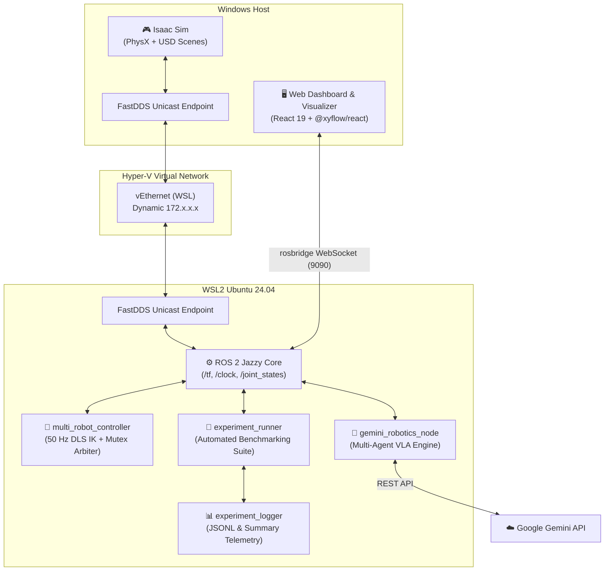
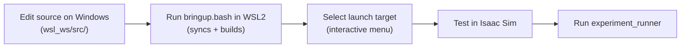

# Development Guide

This guide provides technical details, architectural specifications, and setup workflows for developers and open-source contributors.

---

## 🏗️ System Architecture

The system bridges **NVIDIA Isaac Sim** (Windows) with **ROS 2 Jazzy** (WSL2 Ubuntu 24.04) across a FastDDS Unicast network channel, orchestrating three Franka FR3 robotic arms via Google Gemini Robotics-ER and a React 19 digital twin.



### Component Roles & Host Boundaries

| Component | Host / Runtime | Primary Responsibilities |
|---|---|---|
| **Isaac Sim** | Windows 11 | Rigid body physics (PhysX), synthetic sensor generation, overhead RGB-D camera feeds, `/tf` transform broadcasting |
| **multi_robot_controller** | WSL2 (ROS 2) | 50 Hz closed-loop control, Damped Least Squares IK with Null-Space projection, central table mutex lock, trajectory generation |
| **gemini_robotics_node** | WSL2 (ROS 2) | 4-turn multi-agent brainstorming pipeline, tool schema execution (`pick`, `place`, `place_relative`), closed-loop state tracking |
| **experiment_runner** | WSL2 (ROS 2) | Batch benchmarking execution (S1–S7 scenarios), automated simulation resets, ground-truth TF verification |
| **experiment_logger** | WSL2 (ROS 2) | Captures 35+ metrics across task success, multi-robot coordination (Gini balance), physical accuracy, and VLA throughput |
| **Web Dashboard** | Windows (Browser) | Real-time React Flow v12 workflow graph, 2D digital twin map, Gantt timeline, KPI telemetry, discrete event table |
| **FastDDS Bridge** | Both | Point-to-point cross-OS DDS discovery and communication via dynamic unicast XML profiles |

---

## 🧠 Multi-Agent Cognitive Architecture

The reasoning engine decomposes natural language instructions into synchronized physical actions through a **4-turn Chain-of-Thought (CoT) multi-agent pipeline**:

```mermaid
sequenceDiagram
    autonumber
    actor User as Operator / Web GUI
    participant Node as gemini_robotics_node
    participant Arch as Spatial Architect (📐)
    participant Opt as Agility Optimizer (⚡)
    participant Orch as Orchestrator (🦾)
    participant Ctrl as multi_robot_controller

    User->>Node: Goal Directive ("Build a 9-layer tower" or "3x3 Grid")
    Note over Node,Arch: Turn 1 → Turn 2: Spatial Layout Reasoning
    Node->>Arch: Synthesize 2D spatial arrangement
    Arch-->>Node: 2D ASCII Grid + Target Coordinates (X, Y, Z, Yaw)
    Note over Node,Opt: Turn 2 → Turn 3: Concurrency & Velocity Optimization
    Node->>Opt: Evaluate concurrency & speed recommendations
    Opt-->>Node: Directive: speed='fast', dispatch parallel arm picks
    Note over Node,Orch: Turn 3 → Turn 4: Tool Execution & Dispatch
    Node->>Orch: Generate Function Calling tool calls
    Orch->>Ctrl: execute: pick(FR3_1, Block1, fast) + pick(FR3_2, Block4, fast)
    Ctrl-->>Node: Action Results & Gripper Verification
```

### 1. Spatial Architect (📐)
- **Role**: Spatial geometry and arrangement expert.
- **Reasoning**: Generates a 2D ASCII visual grid representing the target table layout. Maps complex semantic patterns (pyramids, circles, coplanar grids, multi-tower configurations) into millimeter-accurate relative offsets using `place_relative`.

### 2. Agility & Performance Optimizer (⚡)
- **Role**: Task throughput and execution agility optimizer.
- **Reasoning**: Evaluates the physical layout and recommends `speed='fast'` and bold parallel arm dispatches. Because low-level ROS 2 mutex locks (`center_occupied_by`) and singularity-free DLS IK already mathematically guarantee hardware safety, this agent eliminates artificial serialization.

### 3. Orchestrator & VLA Dispatcher (🦾)
- **Role**: Action synthesizer and Function Calling dispatcher.
- **Reasoning**: Binds spatial plans and speed directives into concrete ROS 2 tool dispatches (`pick`, `place`, `place_relative`, `verify_tower`), monitoring arm states until goal completion.

---

## 🔬 Scientific Evaluation & Benchmarking Suite

The repository includes a publication-grade evaluation suite designed for robotics and Physical AI papers (grounded in SayCan, RoCo, SMART-LLM, and BiGym protocols):

### Standardized Benchmark Scenarios

| Scenario | Name | Blocks | Description | Coordination Archetype |
|---|---|:---:|---|---|
| **S1** | Primitive Pick & Place | 1 | Single-arm reach, grasp, transport, and place | Baseline Affordance & IK |
| **S2** | Cooperative 3-Layer Tower | 3 | 3 robots each place 1 block sequentially | Decoupled Pick, Serial Place |
| **S3** | Monolithic 9-Layer Tower | 9 | Complete 9-block tower construction | Workspace Contention & Stability |
| **S4** | 3×3 Coplanar Square Grid | 9 | Planar matrix arrangement centered at origin | Spatial Reasoning & ASCII CoT |
| **S5** | Coplanar Triangle / Pyramid | 6 | 3-tier planar formation (3 base, 2 mid, 1 tip) | Non-Cardinal Relative Offsets |
| **S6** | Cross-Table Staging & Relay | 2 | Sequential handoffs between disjoint workspaces | Dependency Chain Scheduling |
| **S7** | Dynamic Disturbance Recovery | 6 | Adversarial perturbation recovery | Closed-Loop Visual Replanning |

### Execution Commands

```bash
# In WSL2 terminal with ROS 2 environment sourced:
source /opt/ros/jazzy/setup.bash
source ~/catkin_ws/install/setup.bash

# Run 20 trials for scenarios S1, S2, and S3
ros2 run isaac_ros2_control experiment_runner --scenarios S1,S2,S3 --trials 20

# Run full benchmark suite (all 7 scenarios)
ros2 run isaac_ros2_control experiment_runner --scenarios all --trials 20

# Run rule-based baseline comparison
ros2 run isaac_ros2_control experiment_runner --scenarios S1,S2,S3 --trials 20 --baseline

# Compile publication LaTeX tables and vector plots
ros2 run isaac_ros2_control analyze_experiments --log-dir /mnt/d/git/IsaacSim_GeminiRobotics/logs/experiments
```

Generated outputs:
- `logs/experiments/tables/*.tex`: LaTeX tables with 95% Wilson Score confidence intervals.
- `logs/experiments/figures/*.pdf`: Publication-quality vector figures.
- `logs/experiments/summaries/*.csv`: Raw CSV datasets for empirical analysis.

---

## 🦾 Motion Control & Kinematics

### 50 Hz Control Loop & State Machine
The motion controller executes a 50 Hz state machine per arm:
1. `APPROACH_HOVER`: Move to pre-grasp hover position ($Z = Z_{\text{target}} + 0.12\,\text{m}$).
2. `LOWER`: Descend vertically to target height.
3. `GRIPPER_CLOSE` / `GRIPPER_OPEN`: Trigger gripper actuation with physical touch verification.
4. `LIFT`: Ascend back to clearance height ($Z = 0.35\,\text{m}$).
5. `TRANSPORT`: Transfer to target location.
6. `RETRACT_HOME`: Return to resting home posture.

### Tuned Agile Motion Dynamics
Phase step counts per motion segment:
- **`fast`**: **20 steps** (0.4 s per phase at 50 Hz)
- **`normal`**: **40 steps** (0.8 s per phase at 50 Hz)
- **`slow`**: **70 steps** (1.4 s per phase at 50 Hz)

### Damped Least Squares (DLS) Inverse Kinematics
$$\mathbf{J}^\dagger = \mathbf{J}^T (\mathbf{J} \mathbf{J}^T + \lambda^2 \mathbf{I})^{-1}$$
$$\Delta \mathbf{q} = \mathbf{J}^\dagger \mathbf{e} + (\mathbf{I} - \mathbf{J}^\dagger \mathbf{J}) k_{\text{null}} (\mathbf{q}_{\text{home}} - \mathbf{q})$$

The null-space term keeps joints near their comfortable home configuration while accurately tracking Cartesian end-effector targets, mitigating kinematic singularities and joint limit saturation.

### Workspace Collision Mutex
The central workbench zone is protected by an atomic mutex lock in `multi_robot_controller.py`:
- Before descending into the central target area, a robot arm must acquire `center_occupied_by`.
- If another arm holds the lock, the requesting robot holds in a high-clearance hover state, registering a contention event for telemetry tracking.
- Locks are automatically released when the robot lifts back above clearance height or returns home.

---

## 🛠️ Build & Development Workflow



### Sync & Build Rules
- All source files live in `wsl_ws/src/` on the Windows drive.
- `bringup.bash` in WSL2 syncs from the Windows mount, strips CRLF endings, and builds via `colcon build --symlink-install`.
- **Do not** edit code directly inside `~/catkin_ws/src/` in WSL2, as it is refreshed on each bringup.

### Web Dashboard Build
```bash
cd gemini_web_gui
npm install
npm run build
```
Verify zero TypeScript and Vite bundle errors prior to committing.
